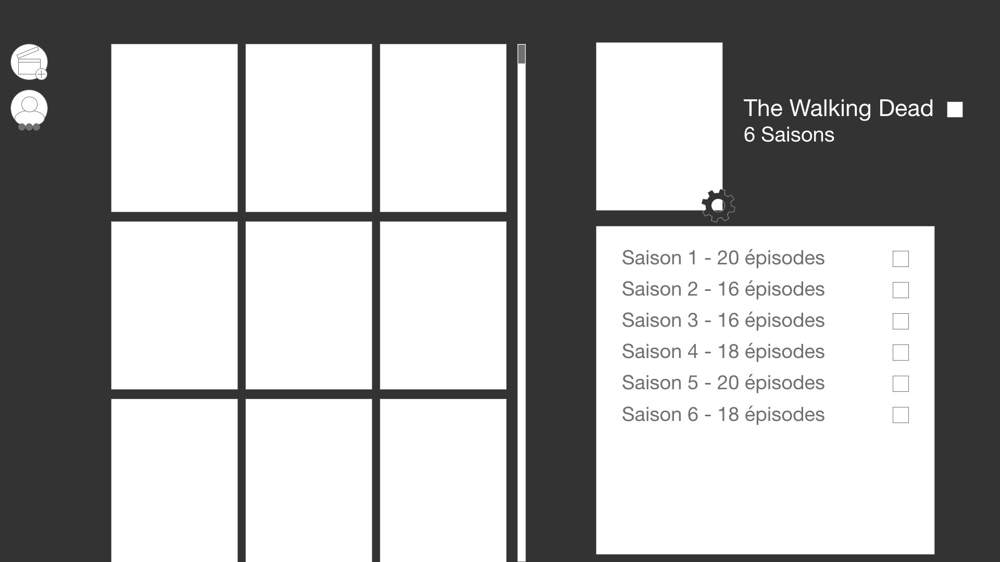
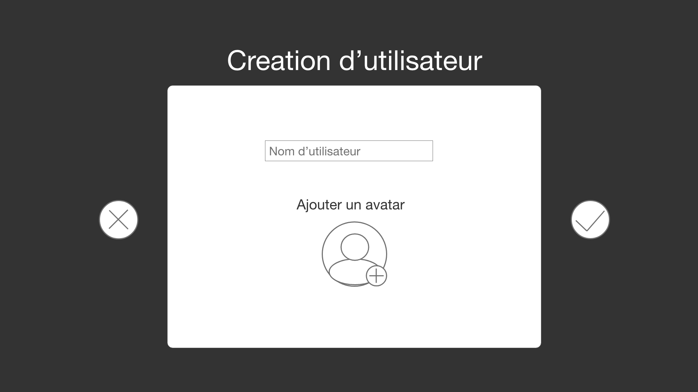
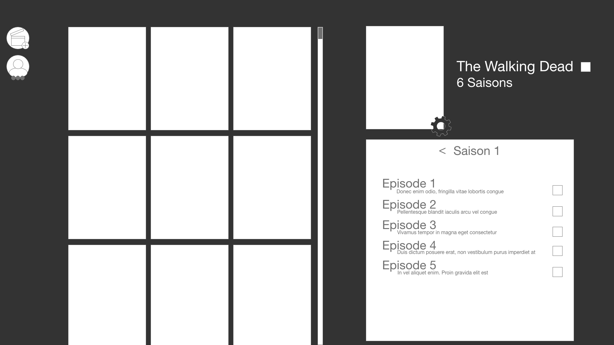
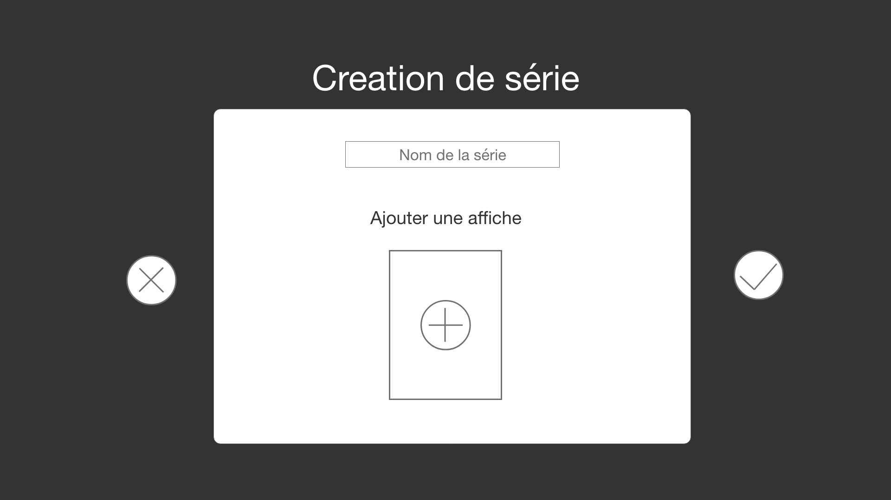
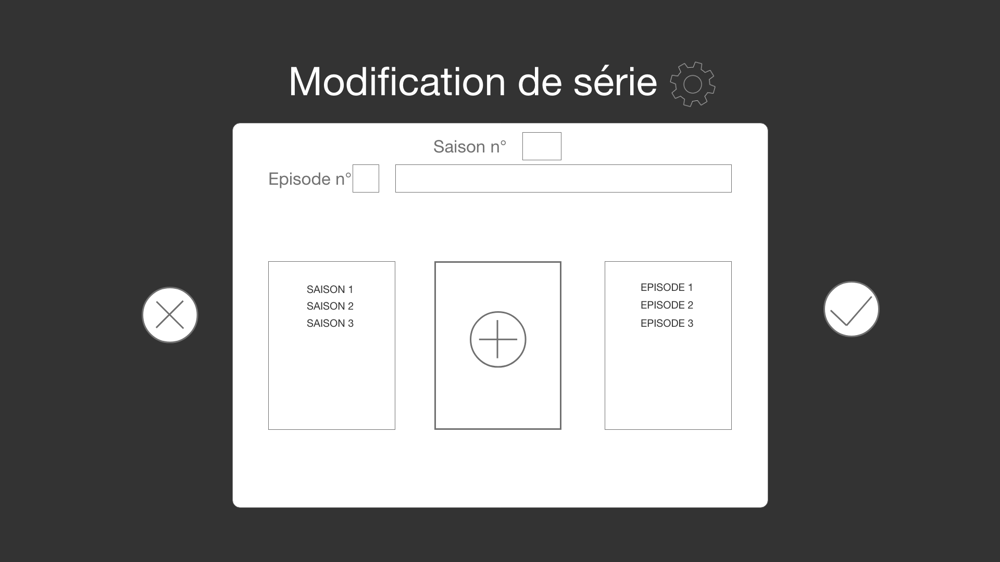
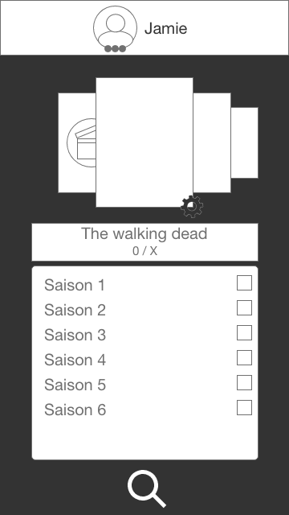
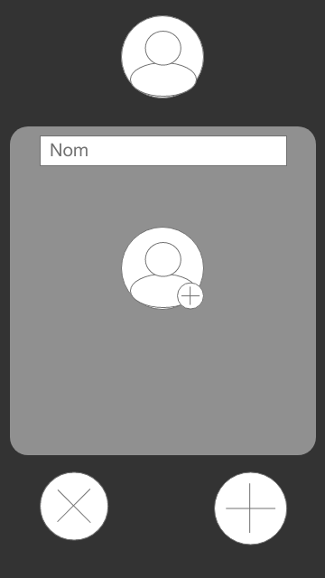
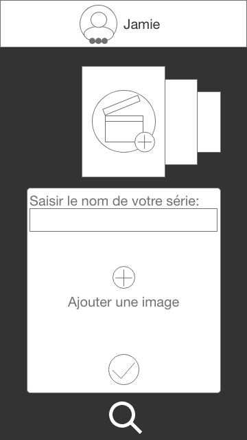
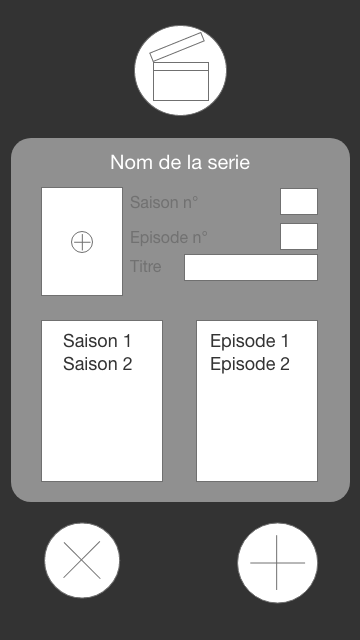

# sept2019-java-tours-SerialSeries
Project 2 - To watch/watched series tracker

Serial Series est un site internet visant a optimser l'experience utilisateur.

Il permet de tenir a jour l'avancement des séries comme une sorte de marque page.

Chaque utilisateur alimente le site avec sa propre expérience.

#Desktop 

#Mobile

